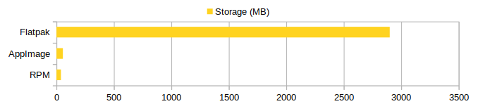

# Fuck Flatpak

Flatpak sucks. And here is why.

## Flatpak is huge!

Let's install yuzu, a popular open source Nintendo Switch emulator. It is written in C++ and uses Qt as front-end.

- Official Flatpak 2.9GB (Repo 1.2GB, Runtime 1.6GB, App 50MB)
- Official AppImage 56MB
- openSUSE RPM 39MB

Flatpak uses 75x more storage than RPM, and 50x more storage than AppImage. This is mainly caused by Flatpak's huge runtime (1.6GB, including Mesa, KDE, etc.) and repo data (1.2GB, cannot be removed).

Here are some suggestions to Flatpak developers:

1. Almost all GNU/Linux distros has built-in Mesa. Why do you need `org.freedesktop.Platform.GL.default` (~700MB)?
2. Yuzu depends on Qt, but not KDE. Why do you need `org.kde.Platform` (~900MB)?
3. Why a Qt app needs `org.gtk.Gtk3theme.Breeze`?

## Reviews by others

- https://flatkill.org/
- https://flatkill.org/2020/
- https://ludocode.com/blog/flatpak-is-not-the-future
